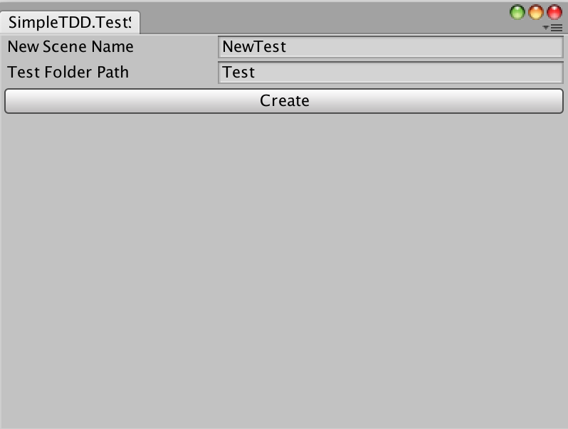
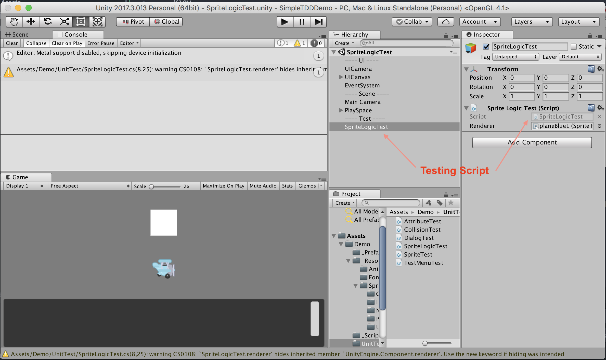
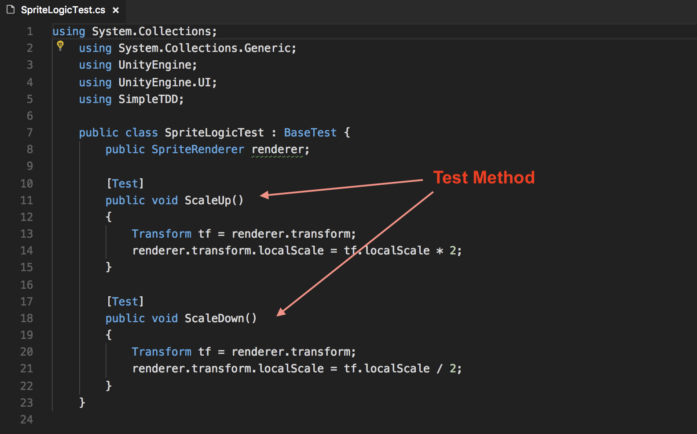

SimpleTDD Framework for Unity
===========

Overview
-----------
SimpleTDD is a framework help developers to build Unit Test in an easy way like what JUnit do. (note:  JUnit is a famous unit test framework in Java)

The objectives of project is to:
- Help developers coding in the Test Driven style
- Easy to create a test without do extra coding such as building GUI
- Make coding more fun (remark: doing repeating things isn't fun!)

Unit Test Demos
----------
An unit test demostrating the Collision:
https://youtu.be/IWZja-UmgGM

Installation
----------
### Method 1: Using Custom Unity Package

This is a simple way to use SimpleTDD, just simply import the pre-export unity package.

#### Steps:
- Download one of the follow packages:
  (Full Version - Include some demo and resources):
  https://drive.google.com/open?id=1KhLmYfdsm_7Qhj52DdSBMCA-pEJ_8F4x

  (Lite Version - Just the Testing Framework):
  https://drive.google.com/open?id=1h_TNAR0Q9taJIYU8Gj481MxNr4tr1fRQ

- Import the package:
  - Open Unity and Your project
  - Select Menu "Assets/Import Package/Custom Package"
  - Select simpleTDD package just downloaded
  - When success, you will see 'SimpleTDD' appear in the 'Assets/Create' Menu

- Testing
  See 'Create Tests' Section   

### Method 2: Download from Github

Another way to use SimpleTDD, it is check out the project from github and export yourself.

#### Steps:
- Download the project from Github : https://github.com/tklee1975/SimpleTDD-unity
  - After Download, Open the Unity project

- Export the package
  - Select 'Assets/Export Package'
  - Select the folder tree of "SimpleTDD"
  - Click "Export" button and save a location and file you want and use later;
    For example: SimpleTDD-unity.unitypackage

- Import the package:
  - Open Unity and Your project
  - Select Menu "Assets/Import Package/Custom Package"
  - Select simpleTDD package just downloaded
  - When success, you will see 'SimpleTDD' appear in the 'Assets/Create' Menu

- Testing
  See 'Create Tests' Section   

#### Notes:
If you want to try the feature of SimpleTDD, simply open the Scene in the 'Demo/' folder in the Assets;

### Create Tests

After setting up the framework, you need to do two things to create your tests:
1. Create Test Scenes
2. Create Test Methods

#### Create Test Scenes

- Select the 'Assets/Create/SimpleTDD/Test Scene' menu
    or '/Create/SimpleTDD/Scene' in the Assets View
- A test scene creation window will be shown

- Define the Test scene name and Test folder location
- Click "Create" to create
- When success, the created Test Scene will be opened.

#### Create Test Methods
- Create a new test Scene or Open an existing one;

- Open the SimpleTDD Test Script; It is attached the game object under the "--- Test ---" section;

- After open the testing script in your script editor, add methods having Attribute '[Test]';

# Supporting Version
- Unity 5.6 or above

Note: Tested using Unity 5.6 and Unity 2017.x

# Help and Support
Free feel to contact me by facebook or twitter for any help or want to support me or want to have any new feature.
- My FB      : https://www.facebook.com/kencoder.hk.9
- My Twitter : https://twitter.com/kenlakoo
